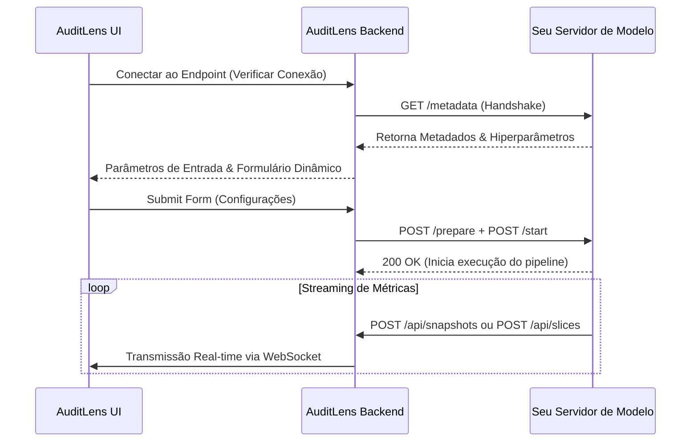

# Guia de Integração: Conectando seu Modelo ao AuditLens

Este guia descreve o protocolo de integração para plugar seus modelos de Machine Learning e algoritmos de detecção ao ecossistema do **AuditLens**. 

---

## 1. Visão Geral da Arquitetura (Server-Driven UI)

O **AuditLens** utiliza uma arquitetura baseada em **Server-Driven UI** para configurar a tela de ingestão e parâmetros do pipeline. Como desenvolvedor de modelo, você **não precisa escrever código de interface gráfica (HTML/JS/CSS)**. 

Seu modelo atua como um servidor HTTP independente. Ao se conectar ao AuditLens:
1. O AuditLens realiza um handshake inicial para consultar os hiperparâmetros suportados pelo seu algoritmo.
2. O formulário de configuração e parametrização é renderizado de forma totalmente dinâmica.
3. As configurações selecionadas pelo usuário são enviadas de volta para o seu modelo iniciar a execução.
4. Seu modelo transmite os snapshots e slices descobertos via formato estruturado padrão.



---

## 2. Endpoint 1: Handshake e Declaração de Metadados (GET)

Seu servidor de modelo deve expor um endpoint HTTP `GET /metadata` (ou `/health` retornando metadados) que declara se o serviço está ativo e quais hiperparâmetros configuráveis ele expõe.

### Contrato de Resposta (GET `/metadata`)

O JSON deve conter o status da conexão, a lista de `parameters`.

```json
{
  "status": "online",
  "parameters": [
    {
      "name": "learning_rate",
      "label": "Learning Rate",
      "type": "float",
      "default_value": 0.001,
      "required": true,
      "constraints": {
        "min": 0.0001,
        "max": 0.1
      }
    },
    {
      "name": "batch_size",
      "label": "Batch Size",
      "type": "int",
      "default_value": 32,
      "required": true,
      "constraints": {
        "min": 8,
        "max": 512
      }
    },
    {
      "name": "model_architecture",
      "label": "Model Architecture",
      "type": "enum",
      "default_value": "transformer",
      "required": true,
      "constraints": {
        "options": ["cnn", "lstm", "transformer"]
      }
    },
    {
      "name": "use_gradient_clipping",
      "label": "Use Gradient Clipping",
      "type": "boolean",
      "default_value": true,
      "required": false
    }
  ]
}
```

### Tipos de Parâmetros Suportados

*   `int`: Valida valores numéricos inteiros. Suporta restrições de `min` e `max`.
*   `float`: Valida valores de ponto flutuante. Suporta restrições de `min` e `max`.
*   `string`: Campo de texto genérico.
*   `boolean`: Renderiza uma caixa de seleção (True/False).
*   `enum`: Renderiza um menu dropdown baseado na lista contida em `constraints.options`.

---

## 3. Endpoint 2: Inicialização e Ingestão de Configuração (POST)

Quando o usuário clica em **Iniciar Modelo**, o AuditLens submete as configurações coletadas. Seu modelo deve expor os endpoints de recebimento:

1.  `POST /prepare`: Prepara e carrega a base de dados em memória.
2.  `POST /start`: Inicia a busca iterativa pelo algoritmo.

### Payload Enviado pelo AuditLens (Exemplo `POST /start`)

O AuditLens envia os hiperparâmetros compilados na chave `"config"`, mapeando as chaves dinâmicas preenchidas na interface:

```json
{
  "config": {
    "learning_rate": 0.005,
    "batch_size": 64,
    "model_architecture": "transformer",
    "use_gradient_clipping": true,
    "budgets": {
      "search": 120.0
    }
  }
}
```

---

## 4. Contrato de Saída de Dados para Visualizações Ricas

Para alimentar o painel e os gráficos interativos do AuditLens em tempo real, seu modelo deve publicar snapshots via requisições `POST` no endpoint `/api/snapshots` do servidor AuditLens.

### 4.1. Slice Discovery e Matrizes de Erro

Usado para identificar subgrupos com taxas de perda ou taxas de falsos positivos desproporcionais. O AuditLens calcula contrastes de qualidade e cobertura por grupo baseado nos atributos fornecidos.

```json
{
  "metrics": {
    "iteration_count": 42,
    "avg_error": 0.18,
    "top_quality": 0.84,
    "explored_nodes": 1240,
    "search_space": 50000,
    "global_errors_class_0": [0.12, 0.15, 0.09],
    "global_errors_class_1": [0.22, 0.35, 0.18]
  },
  "patterns": [
    {
      "id": "female_comment_slice",
      "quality_score": 0.84,
      "attributes": {
        "support_percentage": 15.4,
        "delta_g": 0.35,
        "separation": 0.28,
        "mean_error_mu": 0.45,
        "std_error_sigma": 0.12,
        "p_value_bh": 0.002
      }
    }
  ]
}
```

### 4.2. Heatmap de Sequências (Malware)

Para análises de sequências ou eventos temporais, envie a importância relativa de subsequências específicas (ex: API calls do Windows). A matriz é mapeada com base no peso e suporte da transição de eventos.

```json
{
  "metrics": {
    "iteration_count": 15,
    "feature_importance": {
      "RegOpenKeyEx->RegQueryValueEx": 0.94,
      "RegQueryValueEx->NtWriteFile": 0.88,
      "NtWriteFile->LdrLoadDll": 0.72,
      "LdrLoadDll->CreateProcessInternalW": 0.61
    }
  },
  "patterns": []
}
```

### 4.3. Dispersão de Embeddings (Projeções de Redução de Dimensionalidade)

Para renderizar o gráfico do espaço latente (projeções UMAP ou t-SNE 2D/3D), envie as coordenadas e a classe correspondente.

```json
{
  "metrics": {
    "search_space_diagnostics": {
      "embeddings_projection": [
        {
          "id": "sample_1",
          "x": -2.345,
          "y": 5.612,
          "class": 0,
          "pred": 0.08,
          "label": "benign"
        },
        {
          "id": "sample_2",
          "x": 8.109,
          "y": -1.456,
          "class": 1,
          "pred": 0.92,
          "label": "malware"
        }
      ]
    }
  },
  "patterns": []
}
```

---

## 5. Boas Práticas e Modo Simulação

Para garantir um ciclo de feedback rápido, implemente um **Modo Simulação (Mock Mode)** em sua API de modelo:

1.  **Exponha Rotas Simuladas**: Crie uma rota estática (ex: `/api/simulator/handshake`) que retorna parâmetros genéricos e dados simulados instantaneamente.
2.  **Desenvolva de Forma Isolada**: Teste a resposta a conexões de rede e a integridade de dados sem acionar GPUs ou pipelines de computação massiva.
3.  **Graceful Fallback**: Configure seu microsserviço para falhar de maneira limpa caso receba parâmetros fora dos intervalos numéricos definidos nas restrições (`constraints`) de metadados do handshake.
